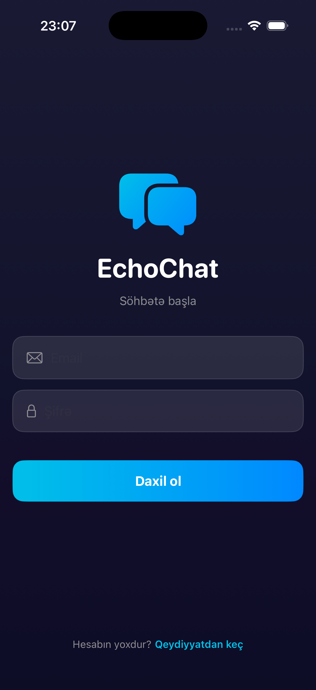
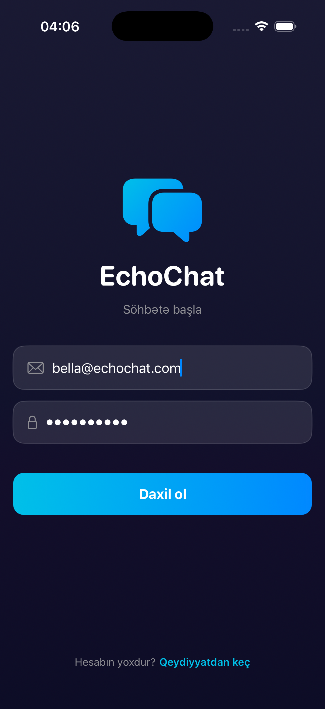
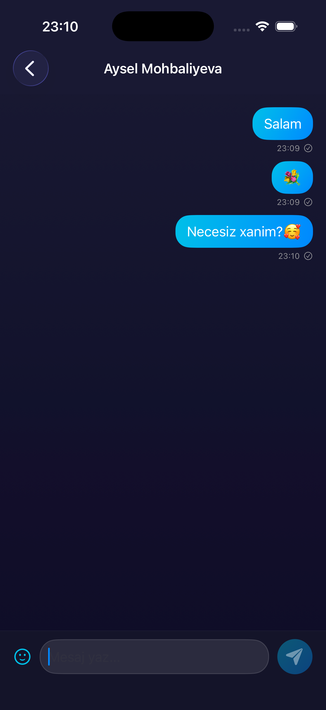

# EchoChat

Firebase-powered real-time iOS chat application built with SwiftUI and MVVM architecture.

## Features

- **Authentication** — Email/password sign-in and registration with Firebase Auth
- **Real-time Messaging** — Instant message delivery using Cloud Firestore listeners
- **Typing Indicator** — See when the other person is typing
- **Read Receipts** — Know when your messages have been read
- **Online Status** — Real-time online/offline status with last seen time
- **Emoji Picker** — Quick emoji selection in chat
- **User Search** — Search and filter users
- **Profile Management** — Edit display name and view account info
- **Dark Theme** — Modern dark UI with gradient accents and spring animations

## Screenshots

<p align="center">
  
  &nbsp;&nbsp;
  
  &nbsp;&nbsp;
  
</p>

## Tech Stack

- **SwiftUI** — Declarative UI framework
- **Firebase Auth** — User authentication
- **Cloud Firestore** — Real-time NoSQL database
- **MVVM** — Model-View-ViewModel architecture
- **Swift Concurrency** — async/await for asynchronous operations
- **@Observable** — Modern state management

## Project Structure

```
EchoChat/
├── Models/
│   ├── User.swift
│   ├── Message.swift
│   └── Chat.swift
├── Services/
│   ├── AuthService.swift
│   ├── ChatService.swift
│   └── UserService.swift
├── ViewModels/
│   ├── AuthViewModel.swift
│   └── ChatViewModel.swift
└── Views/
    ├── Auth/
    │   ├── LoginView.swift
    │   └── RegisterView.swift
    ├── Chat/
    │   ├── ChatListView.swift
    │   └── ChatView.swift
    └── Profile/
        └── ProfileView.swift
```


